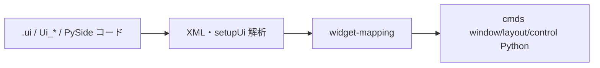

# 変換ワークフロー（cmds 手書き出力）

本スキルの唯一の成果物は、**実行時に PySide / Qt / loadUI を使わない** cmds UI Python である。

## 入力と出力



| 段階 | 内容 |
|------|------|
| 入力 | `.ui` ファイル、または `pyside-uic` の `Ui_*`、または既存 PySide モジュール |
| 処理 | 構造・名前・ラベル・接続の抽出。Qt ランタイムは起動しない |
| 出力 | `cmds.window` から始まる構築コード + コールバック関数 |

## 手順

### 1. 構造の抽出

- ルート widget の `class`（`QDialog` 等）と `name`（objectName）  
- layout ツリー（`QVBoxLayout` → `columnLayout` 候補）  
- 各 control の `text` / `windowTitle` / min・max  
- `<connections>` または `.connect(...)` の一覧  

```bash
python ../scripts/parse_ui_outline.py /path/to/dialog.ui
```

### 2. マッピング

[widget-mapping.md](widget-mapping.md) に従い、各 Qt クラスを cmds コマンドに割り当てる。

未対応クラスは代替 control を決め、コメントで記録する。

### 3. cmds コードの生成

[tool-conventions.md](../../reference/tool-conventions.md) の **UI クラス**、**`WINDOW_TITLE = "{} v{}".format(WINDOW_NAME, VERSION)`**、**シーン切替時の開き直し**を含める。シーン横断ツールだけ `self.reopenOnSceneChange = False`。

推奨パターン:

```python
class DialogWindow(object):
    WINDOW_NAME = "DialogObjectName"
    VERSION = "1.0.0"
    WINDOW_TITLE = "{} v{}".format(WINDOW_NAME, VERSION)

    def __init__(self):
        self.reopenOnSceneChange = True
        self.sceneScriptJobIdList = []

    def deleteWindowIfExists(self):
        if cmds.window(self.WINDOW_NAME, exists=True):
            cmds.deleteUI(self.WINDOW_NAME, window=True)

    def buildUi(self):
        cmds.window(self.WINDOW_NAME, title=self.WINDOW_TITLE, widthHeight=(w, h))
        cmds.columnLayout(adjustableColumn=True)
        # 子 control。必要なら self に UI 名を保持

    def show(self):
        self.deleteWindowIfExists()
        self.buildUi()
        self.installSceneReopenCallbacks()
        cmds.showWindow(self.WINDOW_NAME)
```

UI クラス・scriptJob・`self` の詳細は [tool-conventions.md](../../reference/tool-conventions.md) を参照。

- layout ネストごとに `setParent("..")` で戻る  
- `formLayout` はリサイズ要件がある画面で優先  

### 4. コールバックの移植

| PySide / .ui | cmds 出力 |
|--------------|-----------|
| `button.clicked.connect(fn)` | `cmds.button(..., command=fn)` |
| `accepted` / `rejected` | 各 `button` の `command` で `deleteUI` 等 |
| `+command` / `-command`（.ui 動的プロパティ） | モジュール関数を `command=` に直接渡す |

### 5. 検証

出力コードを目視し、以下を確認する。

- import は `maya.cmds`（と必要最小の `maya.mel`）のみ  
- `loadUI` / `PySide` / `Qt` 文字列が無い  
- Maya Script Editor で `show()` が動作する想定で階層が閉じている  

## 出力してはいけないパターン

以下は **変換結果として提出しない**。

```python
# NG: loadUI
cmds.loadUI(uiFile="tool.ui")

# NG: PySide runtime
from PySide2 import QtWidgets
loader = QUiLoader()
ui = loader.load(...)

# NG: uic を実行時に使う
import ui_design
class Tool(QtWidgets.QDialog, ui_design.Ui_Tool):
    ...
```

## loadUI について

`cmds.loadUI` は Maya が `.ui` を読む公式コマンドだが、本スキルでは **出力に含めない**。

Qt → cmds の対応を調べるときだけ [loadui-mapping-reference.md](loadui-mapping-reference.md) を参照する（Maya 内の `loadUI(listTypes=True)` も同目的）。

## 関連例

- [manual-rewrite-dialog.md](../examples/manual-rewrite-dialog.md)  
- [from-uic-class.md](../examples/from-uic-class.md)
